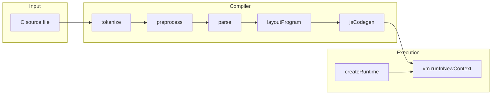

# nodec architecture

This document describes how **nodec** is structured and how data flows from C source to execution. It is aimed at contributors and advanced users who read the TypeScript sources.

## High-level pipeline



1. **`tokenize` / `tokenizeFile`** (`src/tokenize.ts`) — Lexical analysis. Produces a linked list of `Token` values (`ctypes.ts`), including raw preprocessing tokens where needed.
2. **`preprocess`** (`src/preprocess.ts`) — Implements a substantial subset of the C preprocessor:
   - `#include` `"file"` and `<file>` with configurable search paths (`IncludeContext`).
   - Include guards and `#pragma once`.
   - Object-like `#define` / `#undef` and recursive expansion (simplified hideset algorithm).
   - Predefined `__nodec__` macro (empty replacement list) for feature detection.
3. **`parse`** (`src/parse.ts`) — Builds the semantic structure (declarations, statements, expressions) used by later phases. Diagnostics go through `src/diag.ts`.
4. **`layoutProgram`** (`src/jsCodegen.ts`) — Assigns offsets in a single `Uint8Array` (currently **1 × 1024 × 1024** bytes):
   - Non-string globals first (aligned per object).
   - String-literal objects (names like `.L.*`) in a read-only data region.
   - **`heapBase`**: start of the bump heap, 16-byte aligned.
5. **`codegen`** (`src/jsCodegen.ts`) — Emits one JavaScript module body:
   - Wrapper: `(function(__rt) { ... return { "fn_main": fn_main, ... }; })`
   - Each defined function becomes `fn_<cname>` with parameters mapped to `BigInt` (and float values where typed as floating types in the emitter).
   - Locals are `let` bindings initialized to `0n` where applicable; memory-backed data uses `__rt` primitives.

6. **`runInVm`** (`src/runtime.ts`) — Creates a **copy** of the layout memory, constructs `__rt` via `createRuntime`, runs the script in a **new VM context**, and returns the exports object so the host can call `fn_main`.

## Key design choices

### Linear memory and pointers

The backend is **not** tracing GC for C objects. Pointers are **numeric addresses** (`bigint`) into one byte array shared with the runtime:

- **Loads / stores** use `DataView` and explicit sizes (1, 2, 4, 8 bytes) with **little-endian** layout for multi-byte scalars.
- **Pointer arithmetic** uses `__rt.ptrAdd` / `__rt.ptrSub` so that `p + n` scales by `sizeof(*p)` when the type information supports it.

Globals and string literals are emitted as **constant numeric addresses** baked into the JS. Locals that represent C scalars may live as JS `BigInt` variables; taking the address of arbitrary locals is constrained by what the codegen lowers.

### Builtin functions vs user functions

`codegen` recognizes a fixed set of C library names and emits direct `__rt.*` calls:

- `printf`, `sprintf`, `malloc`, `free`, `srand`, `rand`, `time`, `sleep`

Calls to other names resolve to **user-defined** `fn_*` if a definition exists in the same program; otherwise **`__rt.call`** logs and returns zero.

### Isolation and security

`run` uses `vm.runInNewContext` with a minimal sandbox object. This **does not** make untrusted C “safe”: generated JS can still exhaust memory or hit the VM timeout. Treat `nodec run` as a **development tool**, not a hardened sandbox.

### Preprocessor and `__nodec__`

Portable C can use:

```c
#ifdef __nodec__
/* adjustments for nodec's runtime */
#endif
```

## Module map

| Module | Role |
|--------|------|
| `ctypes.ts` | Tokens, AST node kinds, types, symbol (`Obj`) shapes. |
| `tokenize.ts` | Lexer and file/token helpers. |
| `preprocess.ts` | Preprocessor engine and `#include` resolution. |
| `parse.ts` | Parser and semantic scaffolding. |
| `typeops.ts` | Type checking / decoration helpers used by codegen. |
| `jsCodegen.ts` | Memory layout + JS emission. |
| `runtime.ts` | `createRuntime`, `printf` formatting, heap, VM entry. |
| `compile.ts` | Public API: `compileFile`, `compileSource`, `runCompiled`, default include paths. |
| `cli.ts` | `run` / `emit-js` commands. |

## Extending the compiler

- **New libc surface**: Add declarations under `include/` and implement behavior in `createRuntime` in `runtime.ts`; add a branch in the `Funcall` emitter in `jsCodegen.ts` so calls compile to the new `__rt` method.
- **New statements or expressions**: Usually require both `parse`/`typeops` support (if not already present) **and** new cases in `emitExpr` / `emitStmt` in `jsCodegen.ts`. Missing cases fall through to **`0n`** (expressions) or **`/* NodeKind */`** comments (statements), which is a common source of silent bugs during development.

## Related reading

- **[README.md](../README.md)** — Installation, CLI, libc subset table, and user-facing limitations.
